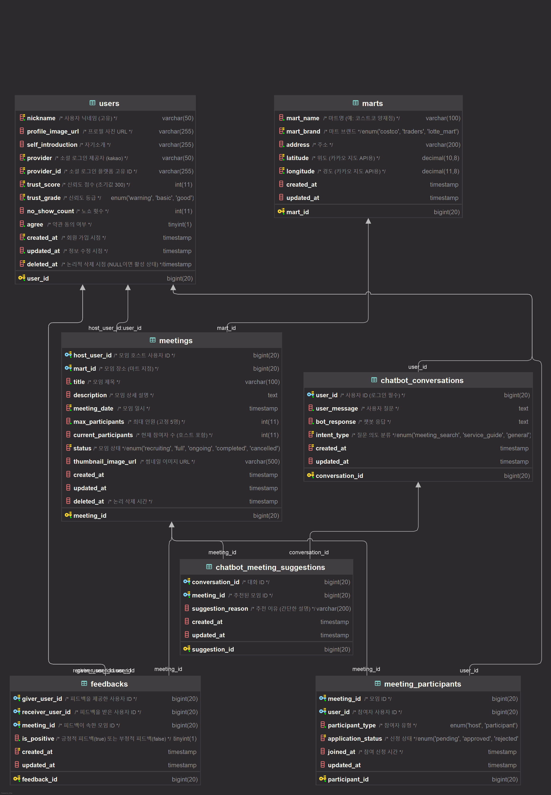

# Natthing 프로젝트 논리 ERD 명세서

## 문서 정보

- **문서명**: Banthing 서비스 논리 ERD 명세서
- **버전**: v1.1.0
- **작성일**: 2025.09.10
- **작성자**: [고동현](https://github.com/rhehdgus8831?tab=repositories)
- **최종 수정일**: 2025.09.11

## 1\. 개요

### 1.1. 문서 목적

본 문서는 **'Natthing'** 프로젝트의 데이터베이스 구조를 정의합니다. 프로젝트에 참여하는 모든 구성원이 데이터 구조에 대해 일관된 이해를 갖고, 효율적인 개발 및 유지보수를 진행하는 것을 목표로 합니다.

### 1.2. 표기법 안내

- **PK (Primary Key)**: 테이블의 각 레코드를 고유하게 식별하는 기본 키입니다.
- **FK (Foreign Key)**: 다른 테이블의 PK를 참조하여 테이블 간의 관계를 설정하는 외래 키입니다.
- **UNIQUE**: 해당 컬럼(또는 컬럼 조합)의 모든 값이 고유해야 함을 나타내는 제약 조건입니다.
- **NOT NULL**: 해당 컬럼에 반드시 값이 존재해야 함을 의미합니다.

-----

> 본격적인 테이블 명세에 앞서, 아래 링크를 통해 전체 데이터의 관계를 나타내는 **개념 ERD**를 먼저 확인하는 것을 권장합니다.  
> [논리ERD](https://www.google.com/search?q=/architecture/conceptual_ERD.md)

## 2\. 테이블 명세

### 2.0. 논리 ERD

### 2.1. `marts`

- **설명**: 코스트코, 이마트 트레이더스 등 대형 마트 지점의 정보를 저장하는 테이블입니다. 카카오 지도 API와 연동하여 지도에 마트 위치를 표시하고, 모임 장소를 지정하는 데 사용됩니다.
- **비고**: 위도(`latitude`)와 경도(`longitude`) 컬럼에 인덱스를 설정하여 위치 기반 검색 성능을 최적화합니다.

| 컬럼명 | 데이터 타입 | 키 | 제약 조건 | 설명 |
| :--- | :--- | :--- | :--- | :--- |
| `mart_id` | BIGINT | **PK** | AUTO\_INCREMENT | 마트의 고유 식별자 |
| `mart_name` | VARCHAR(100) | | NOT NULL | 마트명 (예: 코스트코 양재점) |
| `mart_brand` | ENUM | | NOT NULL | 마트 브랜드 ('COSTCO', 'TRADERS', 'LOTTE\_MART') |
| `address` | VARCHAR(200) | | NOT NULL | 주소 |
| `latitude` | DECIMAL(10, 8) | | NOT NULL | 위도 (카카오 지도 API용) |
| `longitude` | DECIMAL(11, 8) | | NOT NULL | 경도 (카카오 지도 API용) |
| `created_at` | TIMESTAMP | | DEFAULT CURRENT\_TIMESTAMP | 데이터 생성 일시 |
| `updated_at` | TIMESTAMP | | DEFAULT CURRENT\_TIMESTAMP ON UPDATE CURRENT\_TIMESTAMP | 데이터 수정 일시 |

### 2.2. `users`

- **설명**: 서비스에 가입한 사용자의 정보를 관리하는 통합 테이블입니다. 소셜 로그인 정보, 프로필, 신뢰도 시스템 관련 데이터를 포함합니다.
- **비고**: `deleted_at` 컬럼을 사용하여 사용자를 물리적으로 삭제하지 않고, 비활성화 처리하는 **논리적 삭제(Soft Delete)** 방식을 사용합니다. 이를 통해 사용자 데이터를 보존하고 필요시 복구할 수 있습니다.

| 컬럼명 | 데이터 타입 | 키 | 제약 조건 | 설명 |
| :--- | :--- | :--- | :--- | :--- |
| `user_id` | BIGINT | **PK** | NOT NULL, AUTO\_INCREMENT | 사용자의 고유 식별자 |
| `nickname` | VARCHAR(50) | | NOT NULL, **UNIQUE** | 사용자 닉네임 (고유) |
| `profile_image_url`| VARCHAR(255) | | | 프로필 사진 URL |
| `self_introduction`| VARCHAR(255) | | | 자기소개 |
| `provider` | VARCHAR(50) | | NOT NULL | 소셜 로그인 제공자 (예: 'kakao') |
| `provider_id` | VARCHAR(255) | | NOT NULL | 소셜 로그인 플랫폼의 고유 ID |
| `trust_score` | INT | | NOT NULL, DEFAULT 300 | 신뢰도 점수 (초기값 300) |
| `trust_grade` | ENUM | | NOT NULL, DEFAULT 'BASIC' | 신뢰도 등급 ('WARNING', 'BASIC', 'GOOD') |
| `no_show_count` | INT | | DEFAULT 0 | 노쇼(No-Show) 횟수 |
| `agree` | BOOLEAN | | NOT NULL, DEFAULT FALSE | 약관 동의 여부 |
| `created_at` | TIMESTAMP | | NOT NULL, DEFAULT CURRENT\_TIMESTAMP | 회원 가입 시점 |
| `updated_at` | TIMESTAMP | | NOT NULL, DEFAULT CURRENT\_TIMESTAMP ON UPDATE CURRENT\_TIMESTAMP | 정보 수정 시점 |
| `deleted_at` | TIMESTAMP | | | 논리적 삭제 시점 (NULL이면 활성 상태) |

### 2.3. `meetings`

- **설명**: 사용자가 생성하는 '소분 모임'의 핵심 정보를 담는 테이블입니다. 메인 페이지의 모임 목록과 상세 페이지를 구성하는 데 사용됩니다.
- **비고**: `host_user_id`는 `users` 테이블을, `mart_id`는 `marts` 테이블을 참조하는 외래 키입니다. `status`와 `meeting_date`를 함께 인덱싱하여 '모집 중인 모임'을 날짜순으로 빠르게 조회할 수 있도록 최적화했습니다.

| 컬럼명 | 데이터 타입 | 키 | 제약 조건                                                   | 설명 |
| :--- | :--- | :--- |:--------------------------------------------------------| :--- |
| `meeting_id` | BIGINT | **PK** | AUTO\_INCREMENT                                         | 모임의 고유 식별자 |
| `host_user_id` | BIGINT | **FK** | NOT NULL, **UNIQUE**                                              | 모임 주최자(Host)의 사용자 ID (`users.user_id`) |
| `mart_id` | BIGINT | **FK** | NOT NULL                                                | 모임 장소인 마트 ID (`marts.mart_id`) |
| `title` | VARCHAR(100) | | NOT NULL                                                | 모임 제목 |
| `description` | TEXT | |                                                         | 모임 상세 설명 |
| `meeting_date` | TIMESTAMP | | NOT NULL                                                | 모임 약속 일시 |
| `max_participants` | INT | | NOT NULL, DEFAULT 5                                     | 최대 참여 인원 (고정값 5명) |
| `current_participants`| INT | | DEFAULT 1                                               | 현재 참여자 수 (주최자 포함) |
| `status` | ENUM | | DEFAULT 'RECRUITING'                                    | 모임 상태 ('RECRUITING', 'FULL', 'ONGOING', 'COMPLETED', 'CANCELLED') |
| `thumbnail_image_url`| VARCHAR(500) | |                                                         | 썸네일 이미지 URL |
| `created_at` | TIMESTAMP | | DEFAULT CURRENT\_TIMESTAMP                              | 모임 생성 일시 |
| `updated_at` | TIMESTAMP | | DEFAULT CURRENT\_TIMESTAMP ON UPDATE CURRENT\_TIMESTAMP | 모임 정보 수정 일시 |
| `deleted_at` | TIMESTAMP | |                                                         | 논리적 삭제 시점 |

### 2.4. `meeting_participants`

- **설명**: 어떤 사용자가 어떤 모임에 참여하는지를 기록하는 \*\*중간 테이블(Junction Table)\*\*입니다. 이 테이블을 통해 `users`와 `meetings` 간의 다대다(N:M) 관계를 표현합니다.
- **비고**: `meeting_id`와 `user_id` 조합에 UNIQUE 제약 조건을 설정하여 한 명의 사용자가 동일한 모임에 중복으로 참여하는 것을 방지합니다.

| 컬럼명 | 데이터 타입 | 키 | 제약 조건 | 설명 |
| :--- | :--- | :--- | :--- | :--- |
| `participant_id` | BIGINT | **PK** | AUTO\_INCREMENT | 참여 정보의 고유 식별자 |
| `meeting_id` | BIGINT | **FK** | NOT NULL | 참여하는 모임 ID (`meetings.meeting_id`) |
| `user_id` | BIGINT | **FK** | NOT NULL | 참여하는 사용자 ID (`users.user_id`) |
| `participant_type` | ENUM | | NOT NULL | 참여자 유형 ('HOST', 'PARTICIPANT') |
| `application_status` | ENUM | | DEFAULT 'PENDING' | 신청 상태 ('PENDING', 'APPROVED', 'REJECTED') |
| `joined_at` | TIMESTAMP | | DEFAULT CURRENT\_TIMESTAMP | 참여 신청 시간 |
| `updated_at` | TIMESTAMP | | DEFAULT CURRENT\_TIMESTAMP ON UPDATE CURRENT\_TIMESTAMP | 참여 정보 수정 일시 |

### 2.5. `chatbot_conversations`

- **설명**: AI 챗봇 기능에서 사용자와 챗봇 간의 대화 내용을 저장하는 테이블입니다.
- **비고**: `user_id`를 외래 키로 설정하여 로그인한 사용자의 대화 이력을 추적 및 관리합니다.

| 컬럼명 | 데이터 타입 | 키 | 제약 조건 | 설명 |
| :--- | :--- | :--- | :--- | :--- |
| `conversation_id` | BIGINT | **PK** | AUTO\_INCREMENT | 대화의 고유 식별자 |
| `user_id` | BIGINT | **FK** | NOT NULL | 대화를 나눈 사용자 ID (`users.user_id`) |
| `user_message` | TEXT | | NOT NULL | 사용자 질문 |
| `bot_response` | TEXT | | NOT NULL | 챗봇 응답 |
| `intent_type` | ENUM | | DEFAULT 'GENERAL' | 질문 의도 분류 ('MEETING\_SEARCH', 'SERVICE\_GUIDE', 'GENERAL') |
| `created_at` | TIMESTAMP | | DEFAULT CURRENT\_TIMESTAMP | 대화 생성 일시 |
| `updated_at` | TIMESTAMP | | DEFAULT CURRENT\_TIMESTAMP ON UPDATE CURRENT\_TIMESTAMP | 대화 수정 일시 |

### 2.6. `chatbot_meeting_suggestions`

- **설명**: AI 챗봇이 대화 도중 사용자에게 특정 모임을 추천했을 때, 그 추천 기록을 저장하는 테이블입니다.
- **비고**: `conversation_id`와 `meeting_id`를 통해 어떤 대화에서 어떤 모임이 추천되었는지 명확하게 연결합니다.

| 컬럼명 | 데이터 타입 | 키 | 제약 조건 | 설명 |
| :--- | :--- | :--- | :--- | :--- |
| `suggestion_id` | BIGINT | **PK** | AUTO\_INCREMENT | 추천 기록의 고유 식별자 |
| `conversation_id` | BIGINT | **FK** | NOT NULL | 추천이 발생한 대화 ID (`chatbot_conversations.conversation_id`) |
| `meeting_id` | BIGINT | **FK** | NOT NULL | 추천된 모임 ID (`meetings.meeting_id`) |
| `suggestion_reason`| VARCHAR(200) | | | 추천 이유 (간단한 설명) |
| `created_at` | TIMESTAMP | | DEFAULT CURRENT\_TIMESTAMP | 추천 생성 일시 |
| `updated_at` | TIMESTAMP | | DEFAULT CURRENT\_TIMESTAMP ON UPDATE CURRENT\_TIMESTAMP | 추천 정보 수정 일시 |

### 2.7. `feedbacks`

- **설명**: 모임 종료 후 참여자들이 서로를 평가하는 피드백 정보를 저장합니다. 이 데이터는 `users` 테이블의 신뢰도 점수(`trust_score`)를 갱신하는 데 사용됩니다.
- **비고**:
    - `giver_user_id`, `receiver_user_id`, `meeting_id` 조합에 UNIQUE 제약 조건을 설정하여, 한 모임에서 동일한 사람에게 중복으로 피드백을 남길 수 없도록 합니다.
    - **`giver_user_id`와 `receiver_user_id`가 동일할 수 없도록 CHECK 제약 조건을 추가하여, 사용자가 스스로에게 피드백을 남기는 것을 원천적으로 방지합니다.**

| 컬럼명 | 데이터 타입 | 키 | 제약 조건                                                          | 설명 |
| :--- | :--- | :--- |:---------------------------------------------------------------| :--- |
| `feedback_id` | BIGINT | **PK** | AUTO\_INCREMENT                                                | 피드백의 고유 식별자 |
| `giver_user_id` | BIGINT | **FK** | NOT NULL,**UNIQUE**                                            | 피드백을 제공한 사용자 ID (`users.user_id`) |
| `receiver_user_id` | BIGINT | **FK** | NOT NULL,**UNIQUE**                                            | 피드백을 받은 사용자 ID (`users.user_id`) |
| `meeting_id` | BIGINT | **FK** | NOT NULL                                                       | 피드백이 발생한 모임 ID (`meetings.meeting_id`) |
| `is_positive` | BOOLEAN | | NOT NULL                                                       | 긍정(true) 또는 부정(false) 피드백 여부 |
| `created_at` | TIMESTAMP | | DEFAULT CURRENT\_TIMESTAMP                                     | 피드백 생성 일시 |
| `updated_at` | TIMESTAMP | | DEFAULT CURRENT\_TIMESTAMP ON UPDATE CURRENT\_TIMESTAMP        | 피드백 수정 일시 |

-----

## 3\. 변경 이력

| 버전 | 날짜 | 변경 내용 | 작성자 |
| :--- | :--- |:--- |:--- |
| v1.1.0 | 2025.09.11 | `feedbacks` 테이블에 셀프 피드백 방지 제약조건 추가 | 고동현 |
| v1.0.0 | 2025.09.10 | 초기 문서 작성 | 고동현 |