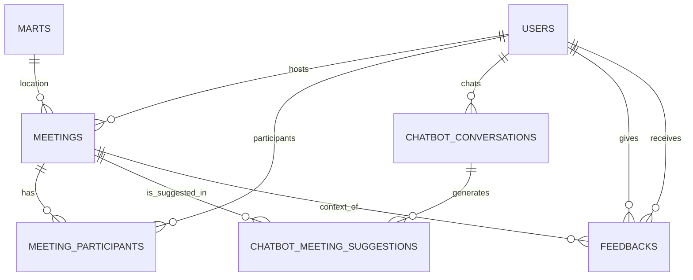

# 반띵 - 대형마트 소분 모임 서비스 개념 ERD 명세서

---

## 문서 정보
- **문서명**: 반띵 서비스 개념 ERD 명세서
- **버전**: v1.0.0
- **작성일**: 2025.09.11
- **작성자**: 강관주
- **최종 수정일**: 2025.09.11

---

## 1. 개요
본 문서는 반띵 서비스의 주요 엔티티(Entity), 속성(Attribute), 관계(Relationship)를 개념 수준에서 정의한 ERD이다.  
서비스 전반의 사용자, 모임, 참여, 피드백, 챗봇 기능의 구조와 흐름을 명확히 하기 위한 목적을 가진다.

---

## 2. 엔티티 정의

### Users (사용자)
- **속성**
    - user_id (PK)
    - nickname
    - profile_image_url
    - self_introduction
    - provider, provider_id
    - trust_score, trust_grade (ENUM: 경고, 기본, 좋음), no_show_count
    - agree (약관 동의 여부)
    - created_at, updated_at, deleted_at
- **설명**: 소셜 로그인 기반 사용자 관리, 신뢰도 점수/등급 포함

---

### Marts (마트 지점)
- **속성**
    - mart_id (PK)
    - mart_name
    - mart_brand (ENUM)
    - address
    - latitude, longitude
    - created_at, updated_at
- **설명**: 모임 장소가 되는 마트 지점 정보 (지도 API 기반 조회용)

---

### Meetings (모임)
- **속성**
    - meeting_id (PK)
    - host_user_id (FK → Users)
    - mart_id (FK → Marts)
    - title, description
    - meeting_date
    - max_participants, current_participants
    - status (ENUM: 모집중, 마감, 진행중, 완료, 취소)
    - thumbnail_image_url
    - created_at, updated_at, deleted_at
- **설명**: 소분 모임 단위 핵심 엔티티

---

### MeetingParticipants (모임 참여자)
- **속성**
    - participant_id (PK)
    - meeting_id (FK → Meetings)
    - user_id (FK → Users)
    - participant_type (ENUM: HOST, PARTICIPANT)
    - application_status (ENUM: PENDING, APPROVED, REJECTED)
    - joined_at, updated_at
- **설명**: 모임에 신청·참여하는 사용자 관리. 호스트도 포함됨.

---

### ChatbotConversations (챗봇 대화)
- **속성**
    - conversation_id (PK)
    - user_id (FK → Users)
    - user_message, bot_response
    - intent_type (ENUM: MEETING_SEARCH, SERVICE_GUIDE, GENERAL)
    - created_at, updated_at
- **설명**: 사용자와 챗봇 간 대화 이력

---

### ChatbotMeetingSuggestions (챗봇 추천 모임)
- **속성**
    - suggestion_id (PK)
    - conversation_id (FK → ChatbotConversations)
    - meeting_id (FK → Meetings)
    - suggestion_reason
    - created_at, updated_at
- **설명**: 챗봇이 대화 중 제안한 모임 추천 기록

---

### Feedbacks (신뢰도 평가 시스템)
- **속성**
    - feedback_id (PK)
    - giver_user_id (FK → Users)
    - receiver_user_id (FK → Users)
    - meeting_id (FK → Meetings)
    - is_positive (BOOLEAN)
    - created_at, updated_at
- **설명**: 모임 완료 후 참여자 간의 신뢰도 평가 (긍정/부정)

---

## 3. 관계 요약
- **Users – Meetings**: 1:N (사용자가 모임을 생성)
- **Users – MeetingParticipants**: 1:N (사용자가 여러 모임에 참여 가능)
- **Meetings – MeetingParticipants**: 1:N (하나의 모임에 여러 참여자)
- **Marts – Meetings**: 1:N (마트 지점에 여러 모임 연결)
- **Users – Feedbacks**: N:N (사용자가 다른 사용자에게 피드백 제공, 특정 모임 단위)
- **Users – ChatbotConversations**: 1:N (사용자의 대화 로그)
- **ChatbotConversations – ChatbotMeetingSuggestions**: 1:N (챗봇 대화에서 여러 모임 추천)
- **Meetings – ChatbotMeetingSuggestions**: 1:N (하나의 모임이 여러 번 추천될 수 있음)

---

## 4. 개념 ERD 다이어그램

---

## 5. 변경 이력

| 버전     | 날짜         | 변경 내용    | 작성자 |
|--------|------------|----------|-----|
| v1.0.0 | 2025.09.11 | 초기 문서 작성 | 강관주 |

---
