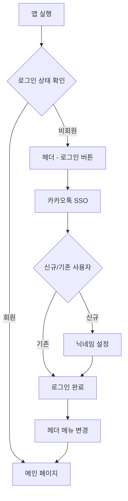
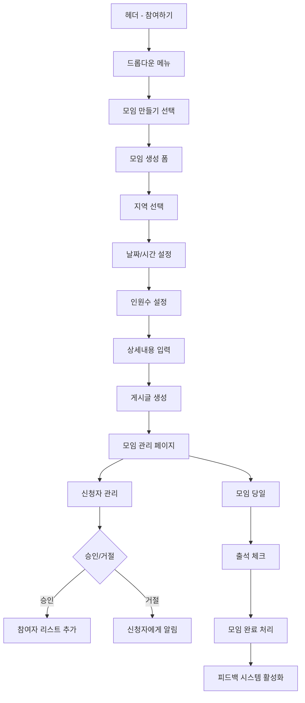
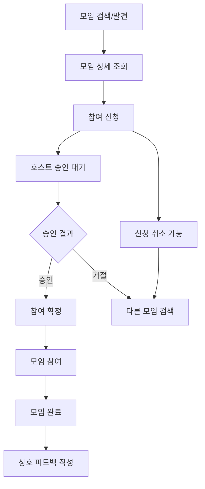
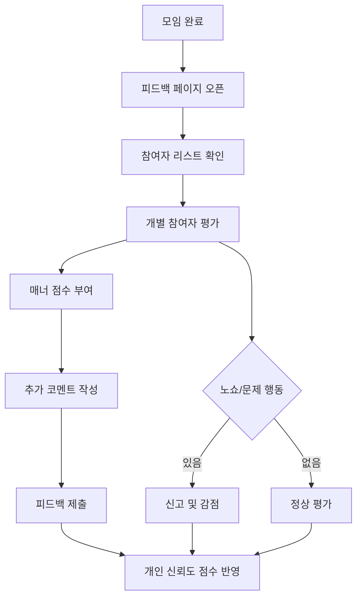

# 반띵 - 대형마트 소분 모임 서비스 User Flow 명세서

---

## 문서 정보
- **문서명**: 반띵 서비스 User Flow 명세서
- **버전**: v1.0
- **작성일**: 2025.09.08
- **작성자**: 박현수
- **최종 수정일**: 2025.09.08

---

## 1. 개요

### 1.1 목적
본 문서는 반띵 서비스의 사용자 흐름(User Flow)을 정의하여 개발팀과 디자인팀이 일관된 사용자 경험을 구현할 수 있도록 가이드를 제공한다.

### 1.2 서비스 개념
코스트코, 트레이더스 등 대형마트에서 대용량 상품을 소분하여 구매하는 모임을 연결하는 플랫폼 서비스

### 1.3 타겟 사용자
- **주 타겟**: 대형마트 대용량 상품 소분 구매를 원하는 일반 소비자
- **부 타겟**: 정기적으로 대형마트를 이용하는 가족 단위 사용자

---

## 2. 사용자 정의 및 권한

### 2.1 사용자 유형

| 사용자 유형 | 설명 | 주요 권한 |
|------------|------|----------|
| **비회원** | 앱 설치 후 로그인하지 않은 사용자 | 모임 리스트 조회만 가능 |
| **회원** | 카카오톡 SSO로 로그인한 사용자 | 모든 기능 이용 가능 |
| **호스트** | 모임을 생성한 회원 | 모임 관리 및 승인/거절 권한 |
| **참여자** | 모임에 참여 신청한 회원 | 신청/취소 및 피드백 권한 |

### 2.2 권한 매트릭스

| 기능 | 비회원 | 회원 | 호스트 |
|------|--------|------|---------|
| 모임 리스트 조회 | ✅ | ✅ | ✅ |
| 모임 상세 조회 | ❌ | ✅ | ✅ |
| 모임 신청/취소 | ❌ | ✅ | ✅ |
| 모임 생성 | ❌ | ✅ | ✅ |
| 신청자 승인/거절 | ❌ | ❌ | ✅ (본인 모임만) |
| 모임 완료 처리 | ❌ | ❌ | ✅ (본인 모임만) |
| 댓글 작성 | ❌ | ✅ | ✅ |
| 피드백 작성 | ❌ | ✅ | ✅ |

---

## 3. 화면 구조 정의

### 3.1 전체 레이아웃 구조

```
┌─────────────────────────────────────────────────┐
│ Header:       반띵 로고 │   참여하기│로그인│회원가입│
├─────────────────────────────────────────────────┤
│ 검색창                                          │
│          Main Content(지도)                     │
│                                                 │
│                                        [AI챗봇]  │
└─────────────────────────────────────────────────┘
```

### 3.2 헤더 정의

#### 3.2.1 비회원 헤더
```
┌─────────────────────────────────────────────────┐
│               반띵 로고 │   참여하기│로그인│회원가입│
└─────────────────────────────────────────────────┘
```

#### 3.2.2 회원 헤더
```
┌─────────────────────────────────────────────────┐
│        반띵       │            참여하기  프로필   │
│      (로고)       │      ▼                      │
│                   │  ┌─────────┐                │
│                   │  │모임만들기│                │
│                   │  │모임찾기 │                │
│                   │  └─────────┘                │
└─────────────────────────────────────────────────┘
```

### 3.3 메인 페이지 구조

```
┌─────────────────────────────┐
│ [검색창]       지도 영역     │
│                             │
│   📍 매장A                  │
│        📍 매장B             │
│             📍 매장C        │
│                             │
│ [AI챗봇]                    │
└─────────────────────────────┘
│ 스팟 클릭 시 모임 리스트     │
│ ┌─────────────────────────┐ │
│ │ 해당 매장 모임 목록      │ │
│ │ - 모임1                 │ │
│ │ - 모임2                 │ │
│ └─────────────────────────┘ │
└─────────────────────────────┘
```

---

## 4. 핵심 User Flow

### 4.1 회원가입/로그인 Flow



### 4.2 모임 생성 Flow (호스트)



### 4.3 모임 참여 Flow (참여자)



### 4.4 피드백 시스템 Flow



---

## 5. 상세 화면별 Flow

### 5.1 메인 페이지 Flow

**진입점**: 홈페이지 첫 화면

**주요 기능**:
- 지도 기반 매장 위치 확인
- 매장별 모임 현황 조회
- 검색을 통한 특정 지역 찾기
- AI 챗봇을 통한 도움말

**Flow**:
1. 지도 로딩 및 매장 핀 표시
2. 사용자 위치 기반 주변 매장 우선 표시
3. 매장 핀 클릭 → 하단 슬라이드업으로 해당 매장 모임 리스트 표시
4. 모임 선택 → 모임 상세 페이지 이동

### 5.2 모임 상세 페이지 Flow

**구성 요소**:
- 모임 기본 정보 (호스트, 일시, 장소, 인원)
- 소분 품목 및 방법 상세
- 댓글 섹션
- 탭 메뉴: [게시글과 댓글(하단)] [회원리스트(호스트와 참여자)]

**참여자 Flow**:
1. 모임 정보 확인
2. [참여 신청] 버튼 클릭
3. 신청 메시지 입력 (선택)
4. 호스트 승인 대기
5. 댓글로 추가 질문 가능

**호스트 Flow**:
1. [신청자] 탭에서 신청자 리스트 확인
2. 각 신청자 프로필 확인
3. 승인/거절 결정
4. [참여자] 탭에서 최종 참여자 관리

### 5.3 마이페이지 Flow

**진입점**: 헤더 - 프로필 클릭

**주요 섹션**:
- 프로필 관리
- 생성한 모임
- 참여한 모임  
- 피드백 현황
- 설정

**Flow**:
1. 프로필 정보 표시 (닉네임, 사진, 신뢰도 점수)
2. 각 섹션별 상세 정보 조회 가능
3. 프로필 편집 → 정보 수정 → 저장

---

## 6. 상태 관리

### 6.1 모임 상태 정의

| 상태 | 설명 | 가능한 액션 |
|------|------|------------|
| **모집중** | 신청 접수 중인 모임 | 신청, 신청취소 |
| **모집완료** | 정원이 찬 모임 | 대기 신청만 가능 |
| **진행중** | 모임 당일 진행 중 | 출석 체크 |
| **완료** | 모임 종료 | 피드백 작성 |
| **취소** | 호스트가 취소한 모임 | 조회만 가능 |

### 6.2 사용자 신뢰도 점수 시스템

**점수 획득**:
- 모임 생성: +10점
- 모임 참여: +5점
- 좋은 피드백 1개당: +2점

**점수 차감**:
- 노쇼: -20점
- 나쁜 피드백 1개당: -5점
- 모임 무단 취소: -15점

**등급 시스템**:
- 🟢 신뢰 (80점 이상)
- 🟡 보통 (50-79점)
- 🔴 주의 (49점 이하)
- 등급에 따라 닉네임 앞 배지 추가 
---

## 7. AI 챗봇 시스템

### 7.1 기능 정의
- **위치**: 전체 화면 우하단 고정
- **접근성**: 모든 페이지에서 접근 가능
- **응답 범위**: 서비스 이용법, 소분 팁, 문제 해결

### 7.2 주요 대화 시나리오

**사용법 문의**:
- "모임은 어떻게 만드나요?"
- "신청은 어떻게 하나요?"
- "피드백은 언제 작성하나요?"

**소분 관련 문의**:
- "코스트코에서 소분하기 좋은 상품은?"
- "몇 명이서 소분하는 게 좋을까요?"
- "소분 방법을 알려주세요"

**문제 해결**:
- "로그인이 안돼요"
- "신청이 안돼요"  
- "노쇼 신고는 어떻게 하나요?"

---


## 8. 향후 확장 계획


## 8.1 예외 상황 처리

### 8.1.1 네트워크 오류
- 오프라인 모드 안내
- 재시도 버튼 제공
- 캐시된 데이터 우선 표시

### 8.1.2 권한 부족
- 로그인 유도 팝업
- 기능 제한 안내 메시지
- 대체 기능 제안

### 8.1.3 데이터 없음
- Empty State 화면 제공
- 대안 액션 제시 (모임 만들기 등)


## 8.2 알림 시스템

### 8.2.1 푸시 알림 유형

| 알림 유형 | 발송 조건 | 메시지 예시 |
|----------|----------|-------------|
| **신청 승인** | 호스트가 신청 승인 시 | "🎉 [모임명] 참여가 승인되었습니다!" |
| **신청 거절** | 호스트가 신청 거절 시 | "😔 [모임명] 참여가 거절되었습니다." |
| **모임 리마인더** | 모임 1시간 전 | "⏰ 1시간 후 [모임명]이 시작됩니다." |
| **새 댓글** | 참여 모임에 새 댓글 | "💬 [모임명]에 새 댓글이 있습니다." |
| **피드백 요청** | 모임 완료 후 | "⭐ [모임명] 참여자들을 평가해주세요!" |

### 8.2.2 인앱 알림
- 헤더 알림 아이콘에 배지 표시
- 실시간 알림 리스트 제공
- 읽음/안읽음 상태 관리


## 8.3 개발 고려사항

### 8.3.1 성능 요구사항
- 지도 로딩 시간: 3초 이내
- 페이지 전환: 1초 이내
- 이미지 로딩: 지연 로딩 적용

### 8.3.2 접근성
- 스크린 리더 지원
- 키보드 네비게이션 지원
- 색상 대비 WCAG 2.1 AA 준수

### 8.3.3 보안
- 카카오톡 SSO 토큰 관리
- 개인정보 암호화 저장
- API 통신 HTTPS 적용

## 9. v1.1~ 예정 기능  
- 예외 처리
- 알림 시스템
- 성능 고려

## 9. v1.2~ 예정 기능
- 그룹 채팅 기능 (댓글x)


---

## 12. 변경 이력

| 버전 | 날짜 | 변경 내용 | 작성자 |
|------|------|----------|-----|
| v1.0 | 2025.09.08 | 초기 문서 작성 | 박현수 |

---

