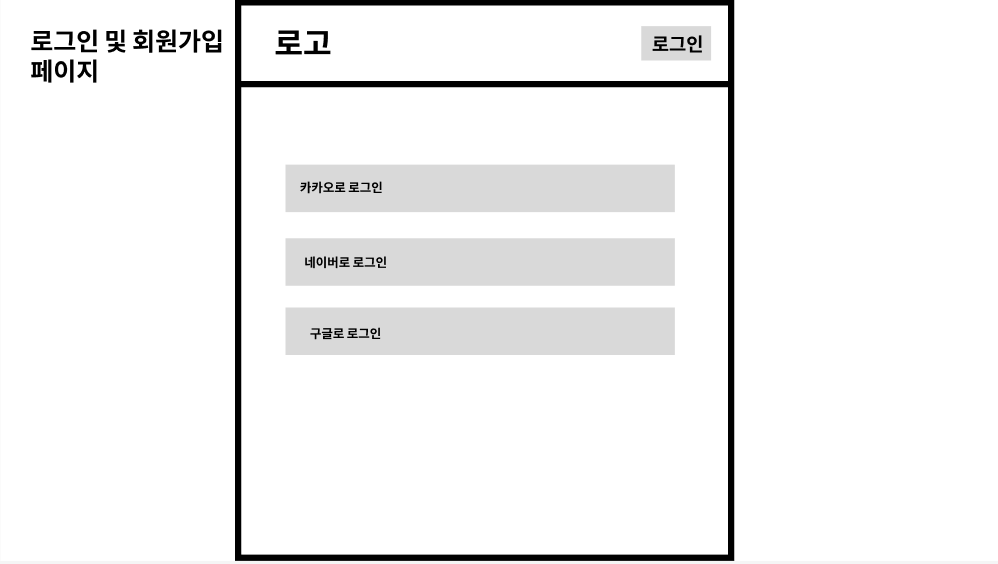
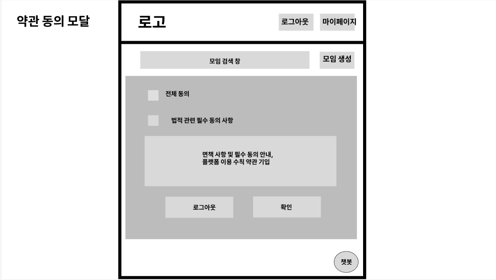
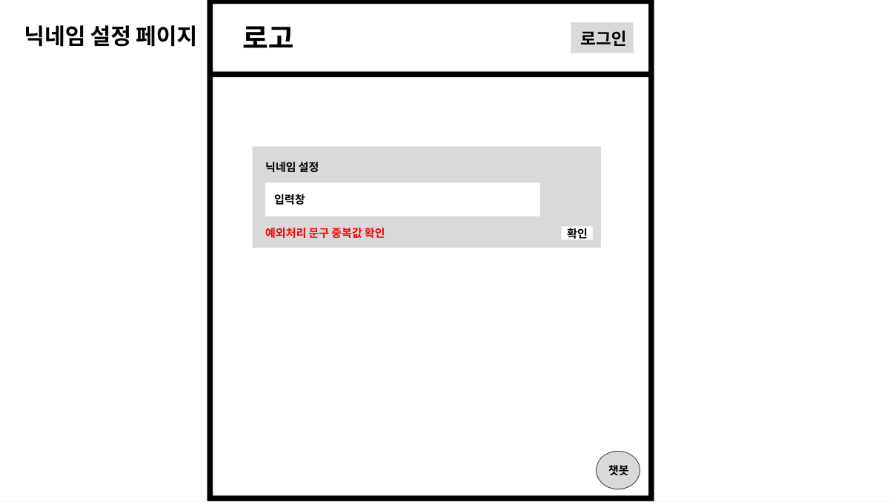

# 1\. 사용자 인증 및 온보딩 화면 명세서

-----

## 문서 정보

- **문서명**: 사용자 인증 및 온보딩 화면 명세서
- **버전**: v1.0.0
- **작성일**: 2025.09.09
- **작성자**: [고동현](https://github.com/rhehdgus8831)
- **최종 수정일**: 2025.09.09

-----

## 1\. 개요 (Overview)

본 문서는 사용자가 서비스에 진입하여 회원가입 또는 로그인을 완료하기까지의 전체 화면 흐름과 기능적 요구사항을 정의합니다. 사용자의 편의성(기존 회원)과 서비스의 안정성(신규 회원의 약관 동의 보장)을 모두 만족시키는 것을 목표로 합니다.

## 2\. 사용자 흐름 (User Flow)

사용자는 \*\*'회원가입'\*\*과 \*\*'로그인'\*\*이라는 명확히 구분된 경로를 통해 인증을 진행합니다.

> **✅ 신규 사용자 (정상 경로)**: `앱 실행` → `회원가입 버튼` → `[AUTH-001] 약관 동의` → `[AUTH-002] 소셜 로그인` → (카카오 인증) → `[AUTH-003] 닉네임 설정` → `(가입 완료)` → `메인 화면`

> **✅ 기존 사용자 (정상 경로)**: `앱 실행` → `로그인 버튼` → `[AUTH-002] 소셜 로그인` → (카카오 인증) → `(로그인 성공)` → `메인 화면`

> **🚨 예외 처리 (신규 사용자가 '로그인' 클릭 시)**: `앱 실행` → `로그인 버튼` → `[AUTH-002] 소셜 로그인` → (카카오 인증) → **(서버에서 신규 회원 감지)** → **`[AUTH-001] 약관 동의`로 강제 이동** → `[AUTH-002] 소셜 로그인` (재시도) → `[AUTH-003] 닉네임 설정` → `(가입 완료)` → `메인 화면`

- 보다 자세한 전체 사용자 흐름은 아래 링크를 참고해주세요.
- [유저 플로우 전체 흐름 보러가기](../user-flow/userFlow.md)

-----

## 3\. 화면 상세 명세 (Screen Specifications)

### 3.1. [AUTH-001] 약관 동의 페이지

- **화면 설명**: **신규 가입자**가 서비스 이용을 위해 필수 및 선택 약관에 동의하는, 회원가입 절차의 첫 번째 관문입니다.

- **진입 조건**: 사용자가 '회원가입' 버튼을 클릭했거나, '로그인' 경로로 진입한 신규 회원임이 서버에 의해 확인되었을 때.

- **와이어프레임**:

  

- **레이아웃 및 구성 요소**

| ID  | 구분     | 요소명                           | 설명                                                                 |
| :-- | :------- | :------------------------------- | :------------------------------------------------------------------- |
| 1-1 | 타이틀   | 페이지 타이틀                    | "로그인" (또는 "회원가입")                                           |
| 1-2 | 체크박스 | 전체 동의                        | 모든 하위 약관을 한번에 선택/해제합니다.                             |
| 1-3 | 체크박스 | 서비스 이용약관 (필수)           |                                                                      |
| 1-4 | 체크박스 | 개인정보 수집 동의 (필수)        |                                                                      |
| 1-5 | 체크박스 | 마케팅 관련 선택 (선택)        |                                                                      |
| 1-6 | 버튼     | 확인                             | 모든 필수 약관에 동의했을 때 활성화됩니다.                           |

- **상호작용 및 정책**
    - `확인` 버튼은 **모든 필수 약관(1-3, 1-4)이 체크되기 전까지 비활성화** 상태를 유지합니다.
    - `확인` 버튼 클릭 시, **`[AUTH-002] 소셜 로그인 페이지`** 로 이동합니다.

-----

### 3.2. [AUTH-002] 소셜 로그인 페이지

- **화면 설명**: 카카오 계정을 통해 서비스를 시작(로그인 또는 회원가입)하는 화면입니다.

- **진입 조건**:

    1.  기존 사용자가 '로그인' 버튼을 클릭했을 때 (가장 일반적)
    2.  신규 사용자가 약관 동의를 완료한 후

- **와이어프레임**:

- **레이아웃 및 구성 요소**

| ID | 구분 | 요소명           | 설명                                               |
| -- | --- | :--------------- | ------------------------------------------------- |
| 2-1 | 버튼 | 카카오로 로그인  | 카카오 인증을 시작합니다. (네이버, 구글은 향후 확장) |

- **상호작용 및 정책 (가장 중요)**
    1.  **'카카오로 로그인' 버튼 클릭 시 동작**:
        - **[회원가입 경로로 진입 시]**: CSRF 공격 방지를 위해 프론트엔드는 **'state 토큰(출발 증표)'을 생성**하여 `sessionStorage`에 저장하고, 이 값을 카카오 인증 요청 시 함께 보냅니다.
        - **[로그인 경로로 진입 시]**: 'state 토큰' 없이 바로 카카오 인증을 요청합니다.
    2.  **카카오 인증 후 서버 로직**:
        - 프론트엔드는 카카오로부터 받은 `인가 코드` (및 'state 토큰')를 백엔드 서버로 전송합니다.
        - 서버는 `인가 코드`로 사용자 정보를 조회 후, 우리 DB와 대조합니다.
            - **[CASE 1: 기존 회원]**: 즉시 **로그인 성공** 처리. JWT 토큰을 발급하고, 프론트엔드는 `메인 페이지`로 이동합니다.
            - **[CASE 2: 신규 회원 + '회원가입' 경로]**: 'state 토큰'이 유효한지 검증 후, **회원가입 절차를 계속 진행**합니다. 프론트엔드를 `[AUTH-003] 닉네임 설정 페이지`로 안내합니다.
            - **[CASE 3: 신규 회원 + '로그인' 경로 (예외 처리)]**: 서버는 계정을 생성하지 않고, **"약관 동의 필요" 라는 특정 응답**을 프론트엔드로 보냅니다. 이 응답을 받은 프론트엔드는 사용자를 **`[AUTH-001] 약관 동의 페이지`로 강제 이동**시킵니다.

-----

### 3.3. [AUTH-003] 닉네임 설정 페이지

- **화면 설명**: 신규 가입자가 서비스에서 사용할 닉네임을 설정하는 마지막 단계입니다.

- **진입 조건**: 서버가 신규 회원임을 확인하고, 약관 동의 절차가 완료되었을 때.

- **와이어프레임**:

- **레이아웃 및 구성 요소**

  | ID  | 구분      | 요소명       | 설명                                      |
  | -- | -------- | ----------- | ---------------------------------------- |
  | 3-1 | 입력 필드 | 닉네임       | Placeholder: "사용하실 닉네임을 입력해주세요" |
  | 3-2 | 버튼      | 가입 완료하기 | 닉네임 유효성 검사를 통과하면 활성화됩니다. |

- **상호작용 및 정책**

    - 닉네임 유효성(글자 수, 중복 등)을 실시간으로 검사합니다.
    - `가입 완료하기` 버튼 클릭 시, 서버에 최종 정보를 전송하여 회원가입을 완료하고 JWT 토큰을 발급받습니다.
    - 가입 성공 시, **`메인 페이지`** 로 이동합니다.

-----

## 변경 이력

| 버전   | 날짜       | 변경 내용                                                                 | 작성자 |
| ------ | ---------- | ------------------------------------------------------------------------- |-----|
| v1.0.0 | 2025.09.09 | 초기 문서 작성                                                            | 고동현 |