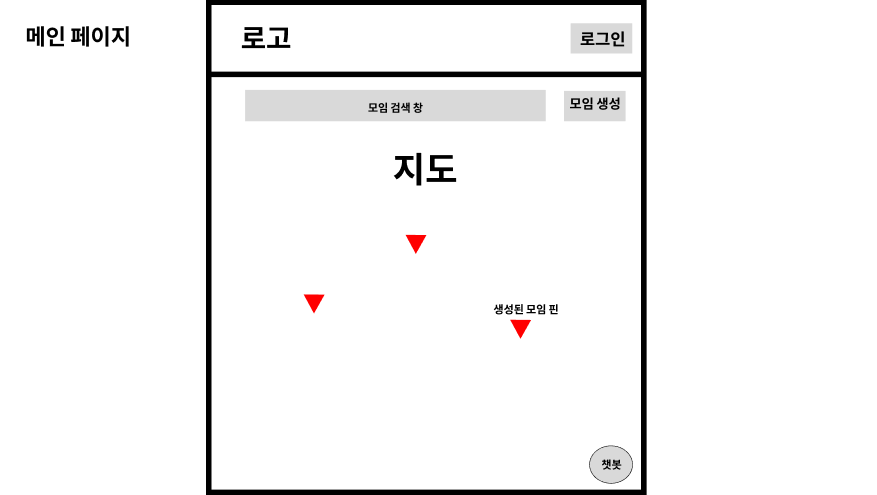
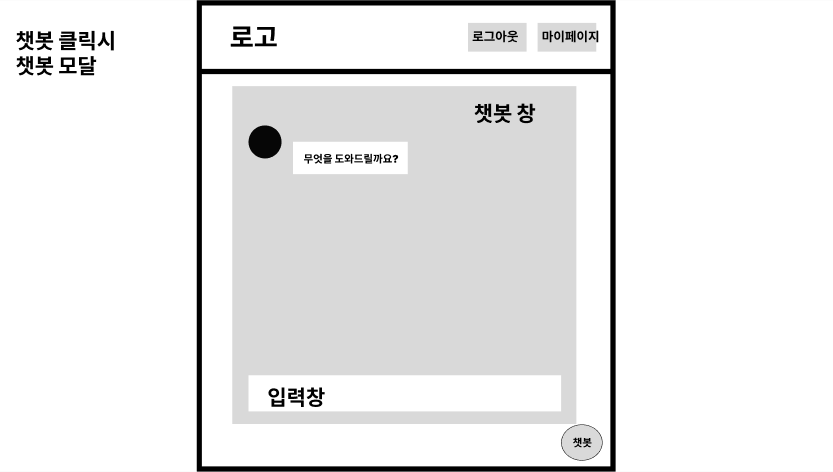

#  메인 화면 및 모임 탐색 화면 명세서

-----

## 문서 정보

- **문서명**: 메인 화면 및 모임 탐색 화면 명세서
- **버전**: v1.0.0
- **작성일**: 2025.09.09
- **작성자**: [고동현](https://github.com/rhehdgus8831)
- **최종 수정일**: 2025.09.09

-----

## 1\. 개요 (Overview)

본 문서는 사용자가 로그인 후 마주하는 서비스의 핵심 영역인 메인 화면과 모임 탐색 기능의 화면 레이아웃과 기능적 요구사항을 정의합니다. 사용자는 지도 기반 인터페이스를 통해 직관적으로 주변의 소분 모임을 탐색하고, AI 챗봇의 도움을 받아 원하는 모임을 쉽게 찾을 수 있습니다.

## 2\. 사용자 흐름 (User Flow)

로그인한 사용자는 메인 페이지에서 지도를 통해 모임을 탐색하고, 특정 모임의 상세 정보를 확인하거나 AI 챗봇을 통해 검색을 보조받을 수 있습니다.

> `로그인 성공` → `[MAIN-001] 메인 페이지 (지도)` → `(마트 핀 클릭)` → `[MAIN-002] 모임 목록 조회` → `(특정 모임 선택)` → `모임 상세 페이지로 이동`
>
> `[MAIN-001] 메인 페이지 (지도)` → `(AI 챗봇 아이콘 클릭)` → `[MAIN-003] AI 챗봇 모달` → `(질의응답 및 모임 추천)` → `모임 상세 페이지로 이동`

- 보다 자세한 전체 사용자 흐름은 아래 링크를 참고해주세요.
- [유저 플로우 전체 흐름 보러가기](https://www.google.com/search?q=../user-flow/userFlow.md)

-----

## 3\. 화면 상세 명세 (Screen Specifications)

### 3.1. [MAIN-001] 메인 페이지 (지도)

- **화면 설명**: 서비스의 핵심 화면으로, 카카오 지도 API를 기반으로 주변 대형마트와 관련 모임 정보를 시각적으로 제공합니다.

- **와이어프레임**:

- **레이아웃 및 구성 요소**

| ID    | 구분        | 요소명                       | 설명                                                                                         |
| :---- | :---------- | :--------------------------- | :------------------------------------------------------------------------------------------- |
| 1-1   | 헤더        | 로고 및 검색창/주소 입력     | 사용자가 특정 지역이나 주소를 검색할 수 있습니다.                                            |
| 1-2   | 헤더        | 내비게이션 메뉴              | '모임 만들기', '마이페이지' 등 주요 기능으로 이동하는 메뉴입니다.                              |
| 1-3   | 메인 콘텐츠 | 지도 영역 (Kakao Map)        | 대형마트의 위치가 핀(Pin) 형태로 표시됩니다.                      |
| 1-4   | 플로팅 버튼 | AI 챗봇 아이콘               | 화면 우측 하단에 고정되어 있으며, 클릭 시 `[MAIN-003]` AI 챗봇 모달을 엽니다.                |

- **상호작용 및 정책**
    - 지도 위의 **마트 핀을 클릭**하면, 화면 하단에서 해당 지점의 모임 목록(`[MAIN-002]`)이 슬라이드업 형태로 나타납니다.
    - 지도 확대/축소 및 이동 시, 보이는 영역 내의 마트 핀 정보가 동적으로 로드되어야 합니다.

-----

### 3.2. [MAIN-002] 모임 목록 조회 (하단 패널)

- **화면 설명**: 사용자가 메인 페이지에서 특정 마트 핀을 클릭했을 때, 해당 지점에서 진행 예정인 소분 모임 목록을 보여주는 컴포넌트입니다.

- **와이어프레임**:

- **레이아웃 및 구성 요소**

| ID    | 구분     | 요소명                 | 설명                                                                                                     |
| :---- | :------- | :--------------------- | :------------------------------------------------------------------------------------------------------- |
| 2-1   | 정보     | 선택된 마트 정보       | 예: "코스트코 양재점"                                                                                    |
| 2-2   | 목록     | 모임 카드 리스트       | 각 모임의 핵심 정보(제목, 상품명, 현재/목표 인원, 마감 시간)를 담은 카드 형태의 UI가 수직으로 나열됩니다. |
| 2-3   | 스크롤   | 무한 스크롤            | 스크롤이 끝에 닿으면 다음 페이지의 모임 목록을 추가로 불러옵니다. |
| 2-4   | 필터/정렬 | 필터 및 정렬 옵션      | (Should) 상품 카테고리, 모임 상태 등으로 필터링하거나 최신순 등으로 정렬하는 기능을 제공합니다. |

- **상호작용 및 정책**
    - 각 **모임 카드를 클릭**하면 해당 `모임의 상세 페이지`로 이동합니다.
    - 모임 목록은 **최신순**으로 기본 정렬됩니다.
    - 데이터 로딩 중에는 스켈레톤 UI 또는 로딩 스피너를 표시하여 사용자 경험을 개선합니다.

-----

### 3.3. [MAIN-003] AI 챗봇 모달

- **화면 설명**: 사용자가 자연어 질의를 통해 원하는 조건의 모임을 대화 형태로 검색할 수 있는 AI 기반 보조 기능입니다.

- **와이어프레임**:

- **레이아웃 및 구성 요소**

| ID    | 구분     | 요소명         | 설명                                                                               |
| :---- | :------- | :------------- | :--------------------------------------------------------------------------------- |
| 3-1   | 대화창   | 메시지 출력 영역 | 사용자와 챗봇의 대화 내용이 표시됩니다.                                            |
| 3-2   | 입력창   | 사용자 질문 입력 | 사용자가 텍스트로 질문을 입력하는 공간입니다.                                      |
| 3-3   | 버튼     | 전송 버튼      | 입력된 질문을 챗봇(서버)으로 전송합니다.                                           |
| 3-4   | 추천 UI  | 추천 모임 카드 | 챗봇이 사용자의 의도에 맞는 모임을 찾아주었을 때, 해당 모임 정보를 카드로 보여줍니다. |

- **상호작용 및 정책**
    - 사용자가 "양재동 근처 세제 소분 찾아줘" 와 같이 자연어로 질문하면, 챗봇은 이 의도를 파악하여 관련 모임을 추천해야 합니다.
    - 챗봇은 소분 준비물(예: "세제 소분하려면 뭐가 필요해?")과 같은 정보성 질문에도 답변할 수 있어야 합니다.
    - 챗봇이 추천한 **모임 카드를 클릭**하면 해당 `모임의 상세 페이지`로 바로 이동할 수 있는 링크가 제공되어야 합니다.
    - 챗봇이 답변을 생성하는 동안에는 '답변 생각 중...'과 같은 시각적 피드백을 제공합니다.

-----

## 변경 이력

| 버전   | 날짜       | 변경 내용                     | 작성자 |
| ------ | ---------- | ----------------------------- |-----|
| v1.0.0 | 2025.09.09 | 초기 문서 작성                | 고동현 |