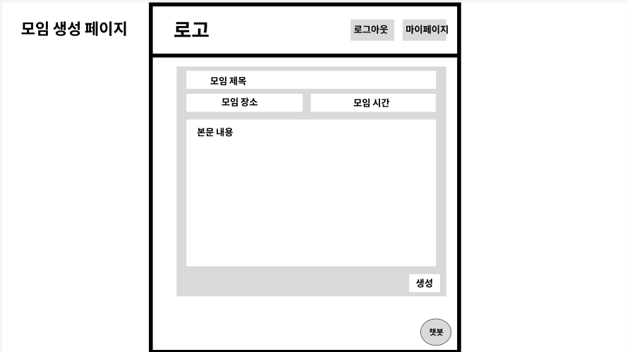

# 모임 상세 정보, 생성 및 참여 화면 명세서

-----

## 문서 정보

- **문서명**: 모임 상세 정보, 생성 및 참여 화면 명세서
- **버전**: v1.0.0
- **작성일**: 2025.09.09
- **작성자**: [고동현](https://github.com/rhehdgus8831)
- **최종 수정일**: 2025.09.09

-----

> **레이아웃 가이드** 
> 본 와이어프레임의 전체적인 구조와 비율은 [레이아웃 가이드](wireframe-layout-giude.md)를 따릅니다

## 1\. 개요 (Overview)

본 문서는 사용자가 모임을 직접 생성하거나, 특정 모임의 상세 정보를 확인하고 참여를 신청하며, 다른 참여자들과 소통하는 모든 과정의 화면 레이아웃과 기능적 요구사항을 정의합니다. 이는 서비스 내에서 가장 핵심적인 상호작용이 일어나는 부분입니다.

## 2\. 사용자 흐름 (User Flow)

사용자는 모임을 직접 생성(호스트)하거나, 기존 모임에 참여(참여자)하는 두 가지 주요 흐름을 따릅니다.

> **✅ 호스트 흐름**: `메인 페이지` → `(헤더 메뉴)` → `[DETAIL-001] 모임 생성 페이지` → `(정보 입력 후 생성)` → `[DETAIL-002] 모임 상세 페이지 (호스트 뷰)` → `(신청자 관리)` → `(모임 진행 및 완료)`

> **✅ 참여자 흐름**: `메인 페이지` → `(모임 목록에서 선택)` → `[DETAIL-002] 모임 상세 페이지 (참여자 뷰)` → `(참여 신청)` → `(호스트 승인 대기)` → `(승인 후 댓글 소통)`

- 보다 자세한 전체 사용자 흐름은 아래 링크를 참고해주세요.
- [유저 플로우 전체 흐름 보러가기](https://www.google.com/search?q=../user-flow/userFlow.md)

-----

## 3\. 화면 상세 명세 (Screen Specifications)

### 3.1. [DETAIL-001] 모임 생성 페이지

- **화면 설명**: 사용자가 새로운 소분 모임을 만들기 위해 필요한 모든 정보를 입력하는 페이지입니다.

- **진입 조건**: 로그인한 사용자가 헤더 메뉴 등에서 '모임 만들기'를 선택했을 때.

- **와이어프레임**:

- **레이아웃 및 구성 요소**

| ID    | 구분     | 요소명               | 설명                                                                                                                                              |
| :---- | :------- | :------------------- | :------------------------------------------------------------------------------------------------------------------------------------------------ |
| 1-1   | 입력 필드 | 모임 제목            | 모임의 주제를 나타내는 제목을 입력합니다.                                                                                                         |
| 1-2   | 입력 필드 | 모임 장소 (주소)     | 카카오 지도 API와 연동하여 정확한 만남의 장소(마트 지점)를 설정합니다. |
| 1-3   | 입력 필드 | 모임 시간            | 만남의 날짜와 시간을 설정합니다.                                                                                                                  |
| 1-4   | 입력 필드 | 본문 내용 (상세 소개)  | 소분할 상품, 예상 비용, 규칙 등 모임에 대한 상세한 내용을 작성합니다. |
| 1-6   | 버튼     | 생성                 | 모든 필수 정보가 입력되었을 때 활성화되며, 클릭 시 새로운 모임을 생성합니다.                                                                      |

- **상호작용 및 정책**
    - 모든 필수 입력 필드(제목, 장소, 시간)가 채워지기 전까지 `생성` 버튼은 비활성화 상태여야 합니다.
    - 인원의 경우 5인으로 고정합니다.
    - 모임 생성 성공 시, 생성된 `[DETAIL-002] 모임 상세 페이지(호스트 뷰)`로 자동 이동합니다.

-----

### 3.2. [DETAIL-002] 모임 상세 페이지

- **화면 설명**: 선택된 모임의 모든 상세 정보를 보여주는 페이지입니다. 사용자의 권한(호스트/참여자/비참여자)에 따라 보이는 정보와 버튼이 달라집니다.

- **와이어프레임**:

- **레이아웃 및 구성 요소**

| ID    | 구분          | 요소명                 | 설명                                                                                         |
| :---- | :------------ | :--------------------- | :------------------------------------------------------------------------------------------- |
| 2-1   | 정보 영역     | 모임 기본 정보         | 모임 제목, 호스트 정보, 시간, 장소, 상태(모집중 등), 참여 인원 현황 등이 표시됩니다.          |
| 2-2   | 정보 영역     | 본문 내용              | 모임 생성 시 작성했던 상세한 소개 내용이 표시됩니다.                                           |
| 2-3   | 탭(Tab) 메뉴  | 참여자 목록 / 댓글     | `[DETAIL-003] 참여자 목록`과 `[DETAIL-004] 댓글` 영역을 전환하며 볼 수 있습니다.             |
| 2-4   | 하단 버튼 영역 | 참여 신청 / 신청 취소 / 신청자 관리 | 사용자의 상태에 따라 다른 버튼이 노출됩니다. (아래 정책 참고)                                  |

- **상호작용 및 정책**
    - **접근 권한**: 로그인한 회원만 상세 페이지에 접근할 수 있습니다. 비로그인 사용자는 목록 페이지만 볼 수 있습니다.
    - **뷰 분기 처리**:
        - **호스트 뷰**: `신청자 관리`, `모임 수정`, `모임 상태 변경` 버튼이 노출됩니다.
        - **참여자 뷰 (신청 전)**: `참여 신청` 버튼이 노출됩니다.
        - **참여자 뷰 (신청 후/승인 후)**: `신청 취소` 버튼이 노출됩니다.
    - `참여인원 수` 버튼 클릭 시, 해당 모임에 신청한 사용자 목록을 확인하고 승인/거절할 수 있는 별도의 모달 또는 페이지로 이동합니다.

-----

### 3.3. [DETAIL-003] 참여자 목록

- **화면 설명**: 해당 모임에 참여가 확정된 사용자와, 참여를 신청하고 대기 중인 사용자의 목록을 보여줍니다.

- **와이어프레임**:

- **레이아웃 및 구성 요소**

| ID    | 구분 | 요소명           | 설명                                                         |
| :---- | :--- | :--------------- | :----------------------------------------------------------- |
| 3-1   | 목록 | 참여자 프로필 리스트 | 각 사용자의 프로필 사진, 닉네임, 신뢰도 등급(배지)이 표시됩니다. |

- **상호작용 및 정책**
    - **호스트**는 확정된 참여자 목록과 대기중인 신청자 목록을 모두 볼 수 있습니다. 
      - 호스트는 해당 페이지에서 대기인원 확인 후 참여 인원으로 확정합니다.
    - **참여자**는 확정된 참여자 목록만 볼 수 있습니다.

-----

### 3.4. [DETAIL-004] 댓글

- **화면 설명**: 모임 참여자들이 모임에 관련된 질문이나 세부 조율을 위해 소통하는 공간입니다.

- **와이어프레임**:

- **레이아웃 및 구성 요소**

| ID    | 구분     | 요소명           | 설명                                                       |
| :---- | :------- | :--------------- | :--------------------------------------------------------- |
| 4-1   | 목록     | 댓글 리스트      | 작성된 댓글들이 시간순으로 나열됩니다.                     |
| 4-2   | 입력 필드 | 댓글 작성 폼     | 사용자가 새로운 댓글을 입력하고 등록하는 공간입니다.       |

- **상호작용 및 정책**
    - **쓰기/수정/삭제 권한**: 오직 **호스트와 승인된 참여자**만 댓글을 작성, 수정, 삭제할 수 있습니다. (**Should Have**: 수정, 삭제)
    - **읽기 권한**: 모임 상세 페이지를 볼 수 있는 모든 회원은 댓글을 읽을 수 있습니다.
    - 자신이 작성한 댓글만 수정/삭제가 가능해야 합니다.

-----
> 모임에 참여하거나 직접 모임을 만든 사용자는 자신의 활동 내역을 확인하기 위해 마이페이지로 이동하게 됩니다. 
> [마이페이지 화면 명세서](wireframe-my-page.md)

## 변경 이력

| 버전   | 날짜       | 변경 내용                     | 작성자 |
| ------ | ---------- | ----------------------------- |-----|
| v1.0.0 | 2025.09.09 | 초기 문서 작성                | 고동현 |