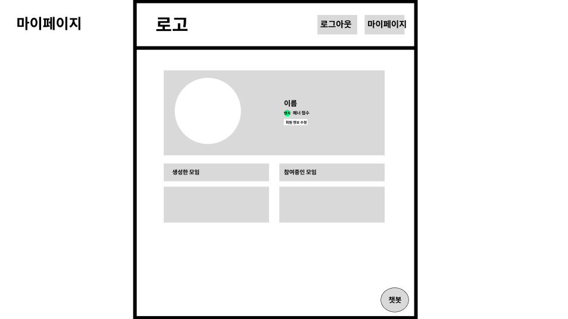

# 마이페이지 화면 명세서

-----

## 문서 정보

- **문서명**: 마이페이지 화면 명세서
- **버전**: v1.0.0
- **작성일**: 2025.09.10
- **작성자**: [고동현](https://github.com/rhehdgus8831)
- **최종 수정일**: 2025.09.10

-----

> **레이아웃 가이드** 
> 본 와이어프레임의 전체적인 구조와 비율은 [레이아웃 가이드](wireframe-layout-giude.md)를 따릅니다

## 1\. 개요 (Overview)

본 문서는 사용자가 자신의 정보를 확인하고 관리하는 개인화된 공간인 '마이페이지'의 화면 레이아웃과 기능적 요구사항을 정의합니다. 사용자는 자신의 프로필, 신뢰도 등급, 그리고 참여했거나 주최한 모임의 역사를 이곳에서 한눈에 파악할 수 있습니다.

## 2\. 사용자 흐름 (User Flow)

사용자는 헤더 메뉴를 통해 마이페이지로 진입하여 자신의 활동 내역을 확인할 수 있습니다.

> `메인 페이지` → `(헤더 메뉴)` → `[MYPAGE-001] 마이페이지` → `(활동 내역 탭 선택)` → `내가 만든/참여한 모임 목록 조회`

- 보다 자세한 전체 사용자 흐름은 아래 링크를 참고해주세요.
- [유저 플로우 전체 흐름 보러가기](https://www.google.com/search?q=../user-flow/userFlow.md)

-----

## 3\. 화면 상세 명세 (Screen Specifications)

### 3.1. [MYPAGE-001] 마이페이지

- **화면 설명**: 사용자의 프로필 정보와 활동 요약을 보여주는 개인화된 통합 대시보드입니다.

- **진입 조건**: 로그인한 사용자가 헤더 메뉴 등에서 '마이페이지'를 선택했을 때.

- **와이어프레임**:

- **레이아웃 및 구성 요소**

| ID    | 구분        | 요소명                       | 설명                                                                                                                                                                 |
| :---- |:----------| :--------------------------- | :------------------------------------------------------------------------------------------------------------------------------------------------------------------- |
| 1-1   | 프로필 영역    | 프로필 사진, 닉네임, 자기소개 | 사용자가 설정한 프로필 정보가 표시됩니다.                                                                                                                          |
| 1-2   | 프로필 영역    | 신뢰도 배지 및 점수          | 사용자의 현재 신뢰도 등급(좋음/기본/경고)이 배지 형태로 표시되며, 현재 점수도 함께 보여줍니다. |
| 1-3   | 버튼        | 회원 정보 수정               | (Should) 프로필을 수정할 수 있는 별도의 페이지로 이동하는 링크입니다. (해당 페이지 명세는 본 문서 범위에서 제외) |
| 1-4   | 탭(Tab) 메뉴 | 생성한 모임 / 참여중인 모임  | 각 탭을 클릭하여 하단 콘텐츠 영역에 표시될 모임 목록을 전환합니다.                                                                                                   |
| 1-5   | 콘텐츠 영역    | 모임 목록                    | 위 탭 메뉴에서 선택된 조건에 맞는 모임들의 리스트(카드 형태)가 표시됩니다.                                                                                             |

- **상호작용 및 정책**

    -   페이지 진입 시, 기본적으로 '생성한 모임' 및 '참여한 모임' 탭이 활성화된 상태로 목록을 보여줍니다.
    - **(Should Have)** `모임 카드`를 클릭하면 해당 모임의 `상세 페이지`로 이동하여 과거 기록을 다시 확인할 수 있습니다.
    - **(Should Have)** 신뢰도 배지 위에 마우스를 올리면, 등급별 점수 기준에 대한 간단한 툴팁(Tooltip)을 표시할 수 있습니다.
    - 모임 목록이 길어질 경우를 대비해 페이지네이션(Pagination) 또는 무한 스크롤을 적용합니다.

-----

## 변경 이력

| 버전   | 날짜        | 변경 내용                                             | 작성자 |
| ------ | ----------- | ----------------------------------------------------- |-----|
| v1.0.0 | 2025.09.10 | 초기 문서 작성                                        | 고동현 |